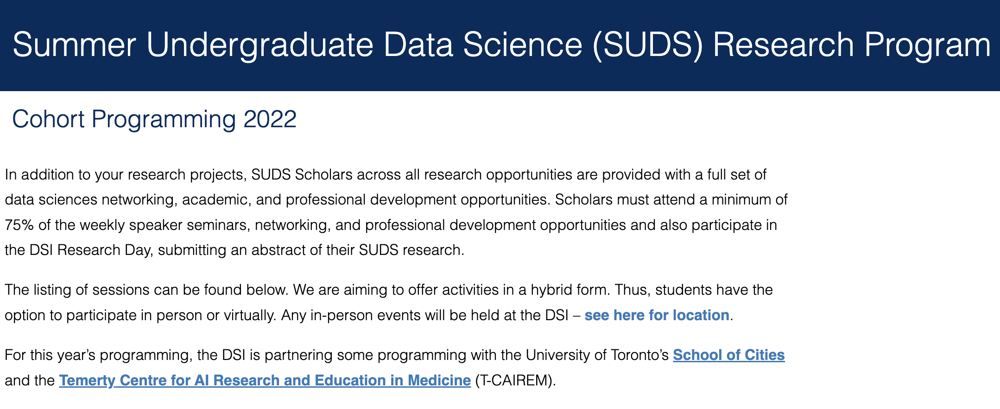
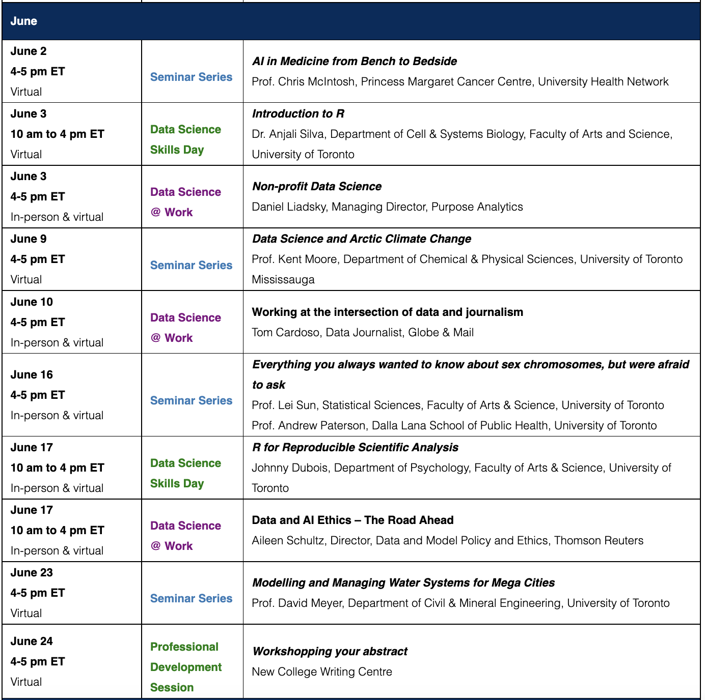

# Introduction To R
# Summer Undergraduate Data Science (SUDS) Research Program

## Cohort Programming 2022
## Date: 3 June 2022, Friday 
## Time: from 10 am to 4 pm

# Introduction
"The SUDS Opportunities Program is an ideal way to get involved in a high-quality and enriching data science opportunity and to experience applications of data science methods and tools in a range of application areas. " For more informtion, see: ghttps://datasciences.utoronto.ca/suds-cohort-program-2022/

